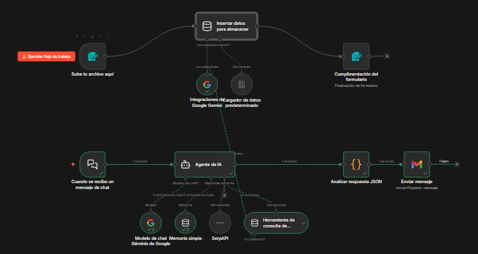
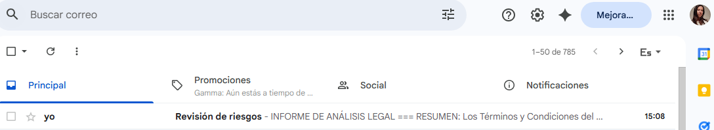
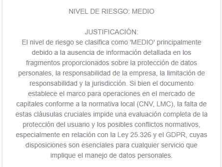
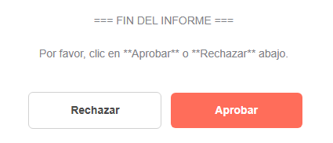

# 🤖 Agente "LETRA CHICA" en n8n para análisis de Términos y Condiciones y Políticas de Privacidad con IA + Human in the Loop

## 🧠 Descripción

Este proyecto llamado "LETRA CHICA" nace de una necesidad cotidiana: **casi nadie lee los términos y condiciones o las políticas de privacidad**.  

Son extensos, complejos y muchas veces esconden cláusulas abusivas.  

La solución desarrollada en n8n busca dar una respuesta tanto:  

- 👤 Al usuario → para entender qué está aceptando  
- 🏢 A la empresa → para auditar si sus políticas cumplen con la normativa vigente antes de publicarlas  

---

## 🚀 El desafío: ir más allá del RAG

Si bien el sistema utiliza **RAG (Retrieval-Augmented Generation)** para consultar documentos sin alucinar, el verdadero diferencial de este flujo es la implementación de:  

👉 **Human in the Loop (HITL)**  

La IA analiza, sugiere y clasifica el riesgo, pero la decisión final de **aprobar o rechazar** queda siempre en manos de una persona mediante validación por correo electrónico.  

---

## 🛠️ Tecnologías y herramientas

- **n8n** → Automatización del flujo  
- **Google Gemini** → Modelo de lenguaje (LLM) 
- **SerpApi** → Consulta de normativa actualizada en la web  
- **Base de datos vectorial** → Almacenamiento y consulta de documentos (RAG)  
- **Gmail API** → Envío de informes y validación humana  

---

## 🔄 Explicación del flujo

Basado en la arquitectura diseñada (ver imágenes del flujo):

### 🔹 Entrada dual

El usuario puede:

- Escribir por chat  
- Subir un documento (PDF / DOCX)  

---

### 🔹 Procesamiento y memoria

- Los documentos se fragmentan  
- Se almacenan en una base vectorial  
- El agente puede consultarlos mediante RAG  

---

### 🔹 Agente de compliance

La IA actúa como asistente legal evaluando si el contenido:

- Cumple o podría entrar en conflicto con:

  - Ley 25.326 (Argentina)  
  - Reglamento (UE) 2016/679 (GDPR)  
  - ISO 27001 (Seguridad de la Información)  
  - ISO 27701 (Privacidad de la Información)  
  - ISO 42001 (Gestión de IA)  

---

### 🔹 Salida estructurada (JSON)

El agente genera un informe estructurado con:

- Resumen  
- Nivel de riesgo  
- Justificación  
- Riesgos detectados  
- Temas legales  
- Cumplimiento normativo  

```json
{
  "resumen": "...",
  "nivel_riesgo": "ALTO",
  "justificacion": "...",
  "riesgos_detectados": [
    {
      "clausula": "...",
      "tipo_riesgo": "...",
      "descripcion": "..."
    }
  ],
  "cumplimiento_normativo": [
    {
      "norma": "GDPR",
      "cumple": "NO",
      "fundamento": "..."
    }
  ]
}
```

---

### 🔹 Human in the Loop (paso clave)

- Se envía el informe por email  
- El flujo se detiene  
- El usuario decide:
  - ✅ Aprobar  
  - ❌ Rechazar  

👉 La decisión final siempre es humana  

---

### 🔹 Acción final

Una vez recibida la decisión:

- El flujo continúa  
- Se registra el resultado (aprobado/rechazado)  

---

## ⚙️ Entorno de ejecución y configuración

Para ejecutar este workflow en n8n es necesario configurar correctamente el entorno:

- Crear las credenciales necesarias (API Keys y accesos)  
- Configurar el modelo de lenguaje (LLM) manualmente en el nodo correspondiente  

🔹 Modelo utilizado en este proyecto:

- **Google Gemini 2.5 Flash**  

⚠️ Importante:  

Las credenciales y la configuración del modelo **no se exportan** en el archivo JSON por motivos de seguridad, por lo que cada usuario deberá configurarlas en su propia instancia de n8n.  

---

## 📥 Importar el workflow en n8n

Para utilizar este proyecto en tu propia instancia de n8n:

### 🔹 Paso 1: Descargar el archivo

- Descargar el archivo `n8n-ai-terms-privacy-workflow.json` desde este repositorio  

---

### 🔹 Paso 2: Importar en n8n

1. Ingresar a tu instancia de n8n  
2. Ir a la sección **Workflows**  
3. Seleccionar **Import from file**  
4. Cargar el archivo descargado  

---

### 🔹 Paso 3: Configurar credenciales

Una vez importado el workflow, será necesario configurar manualmente:

- Credenciales de Google (Gmail)  
- API Key de Gemini  
- API Key de SerpApi
  
---

### 🔹 Paso 4: Ajustes finales

- Configurar el modelo en el nodo LLM (ej: Gemini 2.5 Flash)  
- Definir el correo en el campo **To** del nodo Gmail  
- Verificar que todos los nodos estén correctamente conectados  

---

👉 Una vez completados estos pasos, el workflow estará listo para ejecutarse.

---

## 🔑 Variables y credenciales necesarias

```bash
GEMINI_API_KEY
SERP_API_KEY
Credenciales de Google (Gmail)
```
---

## 🔧 Configuración de APIs

Para que el workflow funcione correctamente, es necesario configurar las siguientes integraciones:

### 🤖 Modelo de IA (Gemini)

- Crear credencial de Google Gemini (API Key)
- Configurar el nodo **Google Gemini Chat Model**
- Seleccionar el modelo disponible en n8n 

⚠️ Nota:

El modelo utilizado en este proyecto fue **Gemini 2.5 Flash**,  
pero la versión disponible puede variar según:

- La versión de n8n  
- La API configurada  
- La disponibilidad del servicio de Google  

Por este motivo, el modelo exacto puede no reflejarse en el JSON exportado.

---

### 🌐 SerpApi (búsqueda web)

- Crear cuenta en SerpApi
- Obtener API Key
- Configurar la credencial en el nodo correspondiente

---

### 📧 Gmail (Human in the Loop)

- Conectar cuenta de Google (OAuth2)
- Habilitar permisos:
  - Lectura de correos
  - Envío de correos
  - Gestión de borradores

👉 Este nodo será utilizado para enviar el informe y esperar la aprobación humana.

---

## 🧠 Procesamiento del JSON (Nodo Function)

Este nodo permite extraer y estructurar correctamente la respuesta generada por el modelo en formato JSON:

```javascript
const output = $input.first().json.output;
const jsonMatch = output.match(/```json\s*([\s\S]*?)```/);
const jsonStr = jsonMatch ? jsonMatch[1] : output;
const parsed = JSON.parse(jsonStr.trim());
return [parsed];
```

---

## 📧 Configuración detallada del nodo Gmail (Human in the Loop)

Para que el flujo funcione correctamente es necesario configurar el acceso a Gmail dentro de n8n.

### 🔐 Permisos requeridos

Al conectar la cuenta de Google, se solicitarán permisos para:

- Leer correos electrónicos  
- Enviar correos electrónicos  
- Gestionar borradores  

Estos permisos son necesarios para poder enviar el informe y recibir la respuesta del usuario en el proceso de validación (Human in the Loop).

---

### ⚙️ Configuración del nodo

1. Conectar la cuenta de Gmail en n8n (Sign in with Google)  
2. Seleccionar la operación:  
   - **Send and Wait for Response**  

3. Configurar el campo **To**:

```text
example@email.com
```

---

### 📌 Destinatarios del informe

👉 El campo **To** es configurable y puede utilizarse para enviar el informe a:

- El propio usuario  
- Un responsable de compliance  
- Un supervisor o área legal  

---

### 🧠 Uso dentro del flujo

El nodo Gmail cumple un rol clave dentro del proceso:

- Envía el informe generado por la IA  
- Detiene el flujo automáticamente  
- Espera una decisión humana (**Aprobar / Rechazar**)  

👉 Esto implementa el concepto de **Human in the Loop**, donde la decisión final no es automática sino supervisada por una persona.

---

## 📊 Formato del informe enviado por email (Nodo Gmail)

Template del informe generado por la IA, enviado al usuario para su revisión y decisión final:

```text
=== INFORME DE ANÁLISIS LEGAL ===

RESUMEN:
{{ $json.resumen }}

NIVEL DE RIESGO: {{ $json.nivel_riesgo }}

JUSTIFICACIÓN:
{{ $json.justificacion }}

RIESGOS DETECTADOS:
{{ $json.riesgos_detectados && $json.riesgos_detectados.length > 0 ? $json.riesgos_detectados.map(r => "- Cláusula: " + (r.clausula || "N/A") + "\n  Tipo de riesgo: " + (r.tipo_riesgo || "N/A") + "\n  Descripción: " + (r.descripcion || "N/A")).join("\n\n") : "No se detectaron riesgos específicos" }}

TEMAS LEGALES:
{{ $json.temas_legales && $json.temas_legales.length > 0 ? $json.temas_legales.map(t => "- " + t).join("\n") : "No se identificaron temas legales" }}

CUMPLIMIENTO NORMATIVO:
{{ $json.cumplimiento_normativo && $json.cumplimiento_normativo.length > 0 ? $json.cumplimiento_normativo.map(c => "• Norma: " + (c.norma || "N/A") + "\n  Cumple: " + (c.cumple || "N/A") + "\n  Fundamento: " + (c.fundamento || "N/A")).join("\n\n") : "No se evaluó cumplimiento normativo" }}

FUENTES UTILIZADAS: {{ $json.uso_fuentes }}
{{ $json.detalle_fuentes && $json.detalle_fuentes.length > 0 ? "Detalle: " + $json.detalle_fuentes.join(", ") : "" }}

⚠️ Este informe busca facilitar la comprensión del documento, pero no sustituye su lectura completa ni el asesoramiento legal profesional.

=== FIN DEL INFORME ===

Por favor, clic en **Aprobar** o **Rechazar** abajo.
```

---

## 💡 Casos de uso

### 👤 Usuarios
- Entender qué aceptan en apps o servicios digitales  
- Detectar riesgos en políticas de privacidad  

### 🏢 Empresas
- Auditar documentos antes de publicarlos  
- Verificar cumplimiento normativo  
- Reducir riesgos legales  

---

## 🔮 Próximos pasos

- Almacenamiento de resultados  
- Generación de reportes automáticos  
- Dashboard de riesgos  
- Historial de decisiones humanas  
- Integración con sistemas empresariales  

---

## ⚠️ Disclaimer

Este proyecto es una herramienta de asistencia y experimentación.  
**No reemplaza el asesoramiento legal profesional ni la lectura completa de los documentos, sino que actúa como una herramienta de apoyo para su comprensión.**

---

## 📷 Capturas del flujo

### 🔄 Flujo completo en n8n


---

### 📧 Recepción del email


---

### 📊 Informe generado


---

### ✅ Decisión humana (Human in the Loop)

